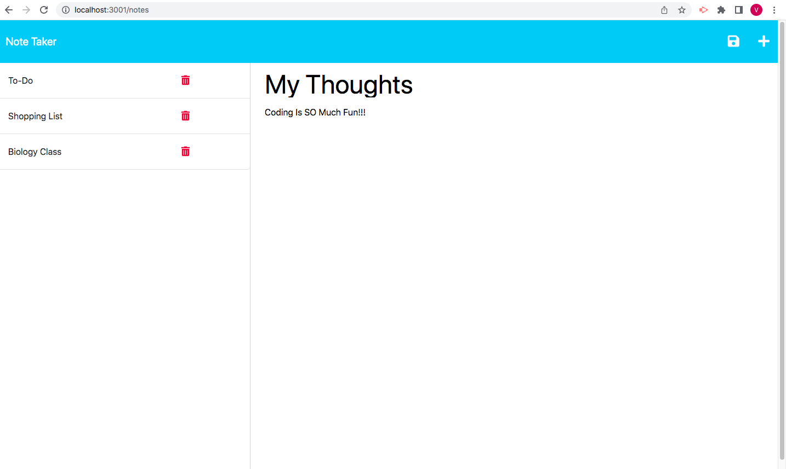

# challenge-11-note-taker

## Description

In this weeks challenge I was tasked to complete the back-end code of an application. This application allowed users to write, save, and delete notes. When the note-taking application is open the user is presented with a homepage/ landing page with a link that takes them to the notes page, when they click it. When the link is clicked the user is presented with existing notes in the left-hand column, and empty fields to input a new note on the right-hand column. When the user inputs a note title and the text of the note, a save icon appears on the top right-hand side of the page. The user is then able to click that save icon and the note that they just inputed will save and appear on the left-hand column along with all the other existing notes. The user is always able to got back to previous notes. They can click on any of the notes in the left-hand column and the note will show up in the right-hand column. The user can then add any additional notes by clicking the add/ write icon in the top right corner. The user is also able to delete any notes. To do this the user can simply click on the trash bin icon on the note that they wish to get rid of. The note will disappear and will no longer be there. 

## Installation

Durning production, for this application to work node, express, and uuid needed to be installed.  

## Usage

This application is a great tool for anyone. It will allow any user to orgainize their day, thoughts, task, etc. This application can be for the average person to create a shopping list, a student trying to take notes, a busy individual trying to organize/ seperate tasks. Regardless of who you are this is wonderful application for anyone.

https://github.com/vitafomin/challenge-11-note-taker

## Credits

N/A

## License

Please refer to the LICENSE in the repo